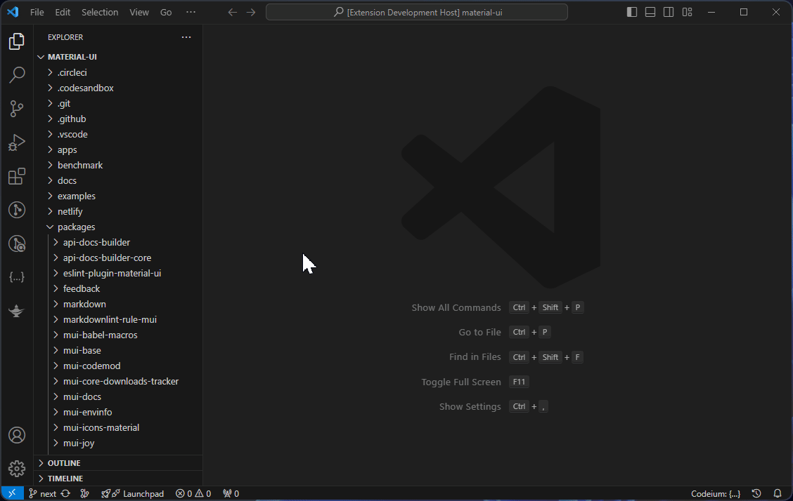

# storybookGPT README

Inspired by https://storybook.js.org/blog/build-your-own-storybook-gpt/

This extension assists you in scanning your React `.tsx` components of current workspace and automates the generation of Storybook stories using OpenAI's chatGPT models.

## Demo

Using MUI source code as example:

## Features

- **Webview Panel**: Open a webview panel to interact with the extension.
- **Find React Components**: Automatically find all React `.tsx` files that do not have corresponding Storybook stories.
- **Generate Stories**: Use OpenAI's GPT model to generate Storybook stories for your React components.

## Requirements

- **OpenAI API Key**: The extension requires an OpenAI API key to generate stories. You can set this key through the extension's prompts.

## Commands

The extension provides the following commands:

- `storybookGPT: Open`: Opens the StorybookGPT webview panel.
- `storybookGPT: Delete OpenAI API Key`: Deletes the stored OpenAI API key from VS Code's secret storage.
- `storybookGPT: Reset OpenAI API Key`: Prompts the user to enter a new OpenAI API key and stores it in VS Code's secret storage.

## How to Use

1. **Open the Webview Panel**: Use the command `storybookGPT: Open` to open the webview panel.
2. **Find Components Without Stories**: The webview will automatically find React components that do not have corresponding Storybook stories.
3. **Generate Stories**: Use the webview interface to generate stories for your components. If the OpenAI API key is not set, you will be prompted to enter it.
4. **Manage API Key**: Use `storybookGPT: Delete OpenAI API Key` to delete the stored API key or `storybookGPT: Reset OpenAI API Key` to update it.

## Release Notes

### 1.0.0

Initial release of storybookGPT.

## Known Issues

- None reported.

**Enjoy!**
